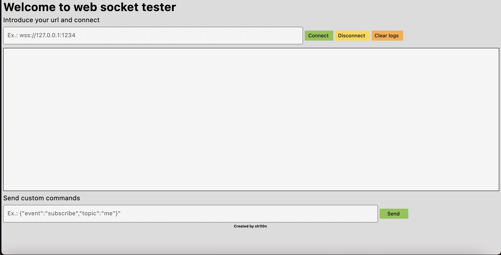

# flutter_web_socket_tester
A basic program for testing web sockets connection, sending and receive messages.

 

Using web_socket_channel package as websocket backend
https://pub.dev/packages/web_socket_channel

# Test on:
https://sh1l0n.github.io/flutter-websockets-tester
